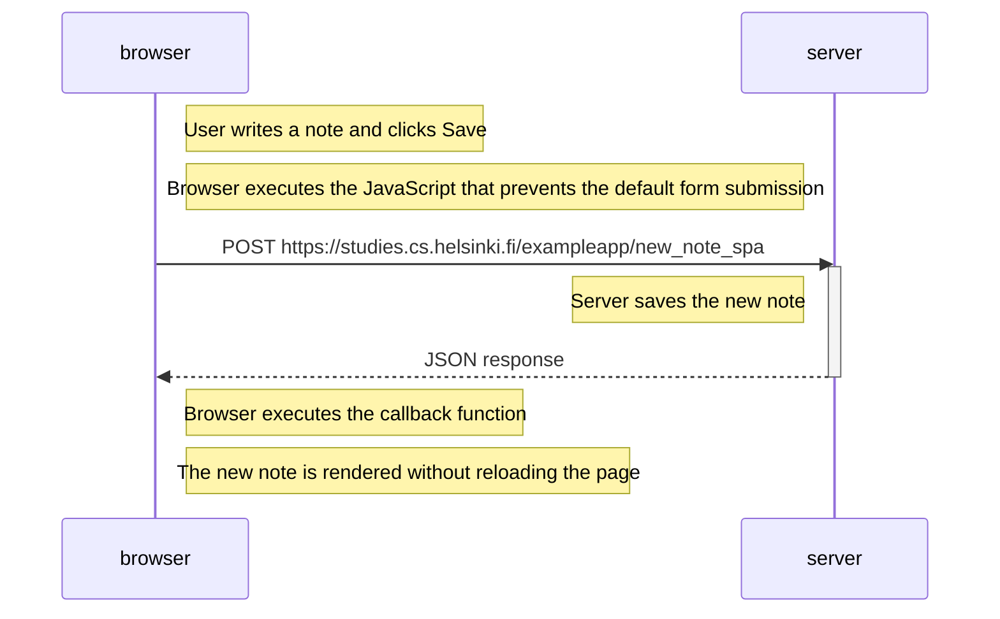

```mermaid
sequenceDiagram
    participant browser
    participant server

    Note right of browser: User writes a note and clicks Save

    Note right of browser: Browser executes the JavaScript that prevents the default form submission

    browser->>server: POST https://studies.cs.helsinki.fi/exampleapp/new_note_spa
    activate server
    Note left of server: Server saves the new note
    server-->>browser: JSON response
    deactivate server

    Note right of browser: Browser executes the callback function
    Note right of browser: The new note is rendered without reloading the page
```